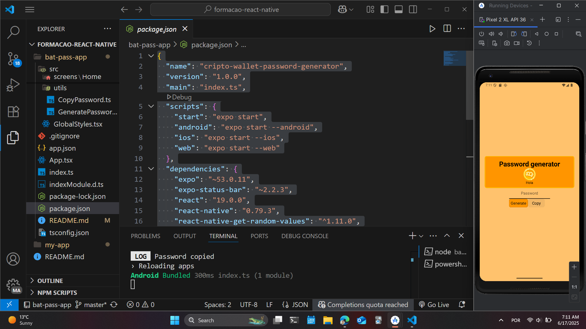

Perfeito. Aqui está um `README.md` profissional e bem estruturado para o seu projeto:

---

# 🔐 Cripto Wallet Password Generator

A simple React Native app built with Expo that generates strong, secure, random passwords, inspired by cryptocurrency wallets. You can easily copy the generated password to your clipboard with a single tap.


---

## 🚀 Features

* 🔑 Generates highly secure, random passwords
* 🔄 Animated Bitcoin logo for visual appeal
* 📋 One-click copy to clipboard
* 🎯 Simple and clean UI
* 💡 Built with React Native and Expo

---

## Future Features

* 💡 Choose the quantity of characters
* 💡 Store your saved your passwords

---

## 📦 Installation

### Prerequisites

* ✅ Node.js installed
* ✅ Expo CLI installed globally (`npm install -g expo-cli`)
* ✅ Android/iOS emulator or Expo Go app on your phone

### Clone the repository

```bash
git clone https://github.com/your-username/cripto-wallet-password-generator.git
cd cripto-wallet-password-generator
```

### Install dependencies

```bash
npm install
# or
yarn install
```

### Run the app

```bash
npm start
# or
yarn start
```

Then scan the QR code with **Expo Go** on your phone or run it on an emulator:

```bash
npm run android
npm run ios
npm run web
```

---

## 🏗️ Project Structure

```
/src
 ├── components
 │   ├── BitcoinLogo
 │   ├── CopyButton
 │   └── InputBox
 ├── screens
 │   └── Home
 ├── utils
 └── GlobalStyles.tsx
/assets
```

---

## 🧠 Technologies Used

* React Native
* Expo
* TypeScript
* Expo Clipboard
* React Native Animated API

---

## ✨ How It Works

* Click **Generate** to create a random, secure password.
* Click **Copy** to copy the password to your clipboard.
* The rotating Bitcoin logo adds a fun visual while using the app.

---

## 🔧 Scripts

| Script            | Description                            |
| ----------------- | -------------------------------------- |
| `npm start`       | Start Expo project                     |
| `npm run android` | Run on Android emulator/device         |
| `npm run ios`     | Run on iOS simulator/device (Mac only) |
| `npm run web`     | Run on web browser                     |

---

## 📜 License

This project is licensed under the MIT License.
Feel free to use, modify, and share.

---

## 🤝 Contributing

Pull requests are welcome. For major changes, please open an issue first to discuss what you would like to change.

---

## 📱 Demo Preview



---

## 🔗 Contact

* GitHub: [@macielphp](https://github.com/macielphp)

---
